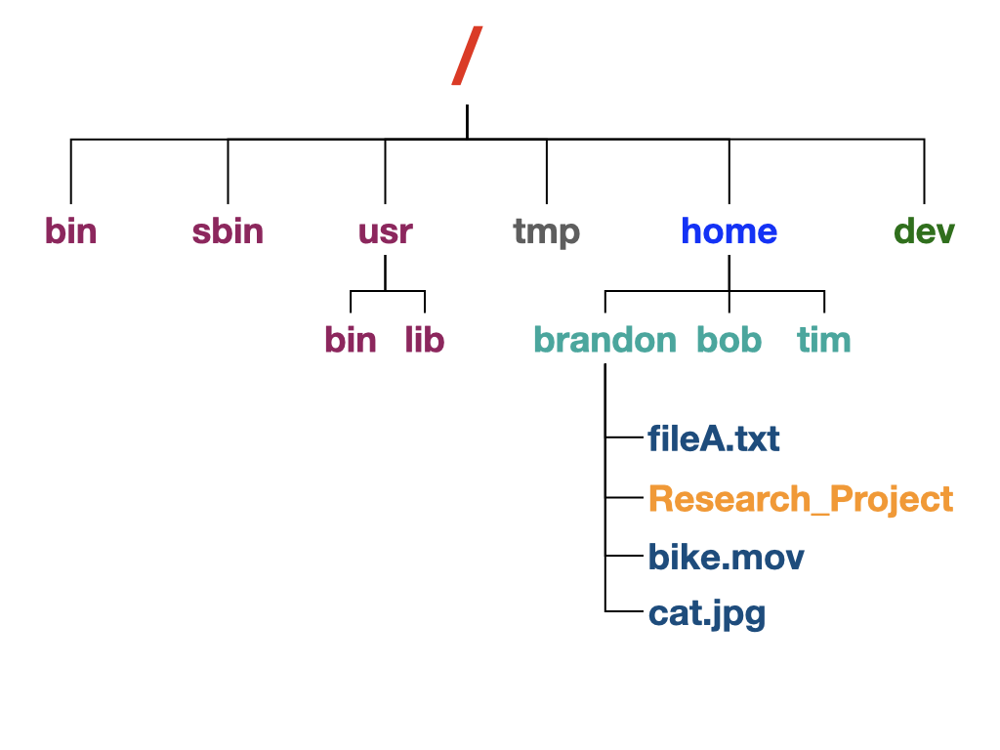

# 01 - The Unix Operating System

**Presenter:** Brandon Le  
**Estimated Time:** 5-10 minutes

In this lesson, we will learn about the Unix file system and the organization of files, folders, applications, and devices within the system.

The Unix file system is organized like an upside-down tree. A simplified Unix file system tree is shown below.

<figure>

<figcaption align = "center"> 
Fig 1. Example of a Unix file system </b> </figcaption>

</figure>

**Directory:**

- **/** : This is the root directory of the file system.
- **/bin** :  Essential low-level system utilities
- **/sbin** : Superuser system utilities (for system admin tasks)
- **/usr/bin** : Higher-level system utilities and applications
- **/usr/lib** : Program libraries for higher-level user programs
- **/tmp** : Temporary storage space accessible by all users
- **/home** : User home directory  
- **/dev** : Connected Hardware devices

> **Important:** Every command is executed within a directory. By default, when you log in or start up, you're in your home directory.
