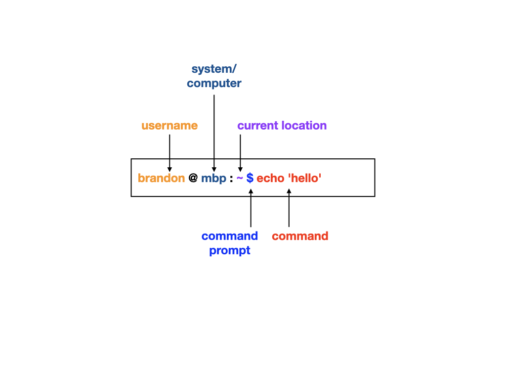

# 02 - Navigating the Unix File System

**Presenter:** Brandon Le  
**Estimated Time:** 15-20 minutes

In this lesson, we will learn how to navigate the Unix file system from the command line in Terminal.

## The command line prompt

The command line prompt is the interface at which you'll type commands to navigate around the file system or to run a program. 

<figure>



<figcaption align = "center"> Fig 2. Command Line Prompt </b> </figcaption>

</figure>

The command line prompt consists of several parts:

- username
- system/computer (e.g. remote server name)
- current path/location within the file system
- command prompt (usually with a **$** but can also be **>**)
- command

> **Note:** These are common features of the command line prompt but it can be configured in a variety of different patterns.

## Where am I?

To determine your absolute path within the file sytem, use the ***pwd*** command. This will provide the absolute path starting from the root directory.

**pwd** : **p**rint [current] **w**orking **d**irectory

```
$ pwd
```

## Who's there?

To identify what's in a directory, we can use the ***ls*** command. This command list the content of the directory including files and folders.


I. Listing the content of the current directory (no target directory indicated)
```
$ ls
```

II. Listing the content of a specific directory
```
$ ls ~/home/brandon
```

## How do I get out of here?

To change to a different directory, we will use the **cd** command.

**cd** : **c**hange **d**irectory

**~** : tilde is a shortcut for the user's home directory  
**.** : a single period denotes the current directory  
**..** : double periods "move up" one directory  

Go to the root directory

```
$ cd /
```

Go up one directory
```
$ cd ..
```

Go up two directories
```
$ cd ../..
```

Go to the home folder

```
$ cd
$ cd ~
$ cd /home/username
```

## Relative versus Absolute Path

A path to a directory or file can be absolute (starting from root) or relative (starting from the current directory)

Suppose you're in the user home directory (/home/username) and you want to go to the "/tmp" storage directory

Absolute path

```
cd /tmp
```

Relative path

```
cd ../../tmp
```

> **Code Interpretation:** Starting from the current directory (/home/username), you move up one directory (..) to get to the home directory (/home) and up another directory (..) to move to the root directory (/). From the root directory, you can now move into the tmp directory.