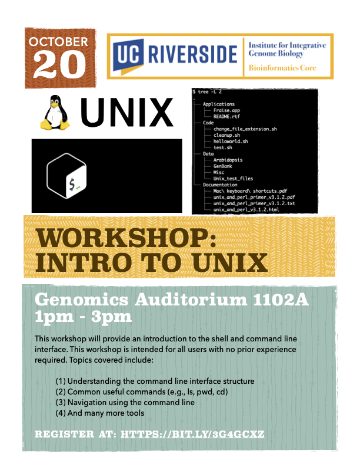

# Intro-to-Unix

<figure>

</figure>

This workshop will provide an introduction to the shell and command line interface. This workshop is intended for all users with no prior experience required. Topics covered in this workshop includes:

Understanding the command line interface structure
Common useful commands (e.g., ls, pwd, cd)
Navigation using the command line
Creating and removing files/folders
Linking commands
Advance commands

## General Information
**Location**: Genomics Auditorium 1102A  
**Time**: 1PM - 3PM  
**Date**: October 20, 2022  
**Presenter**: Brandon Le

## Registration Link

https://bit.ly/3g4gCXZ

## Survey Link

Coming Soon!

## Requirements
Attendees should have a laptop (Mac or PC) to follow along in the workshop. If you don’t have a laptop, you can check one out at the [Tomas Rivera](https://library.ucr.edu/libraries/tomas-rivera-library) or [Orbach Science](https://library.ucr.edu/libraries/orbach-science-library) Library. Go to the library circulation desk for more information.

Mac Users: The MacOS have a built-in terminal program for the command line interface and requires no additional software installation.

PC Users: The WinOS does not automatically come with a terminal/shell system pre-installed. For Windows 10 and 11 users, you can follow the instructions in this [link](https://learn.microsoft.com/en-us/powershell/scripting/install/installing-powershell-on-windows?view=powershell-7.2) to install PowerShell onto your system.

